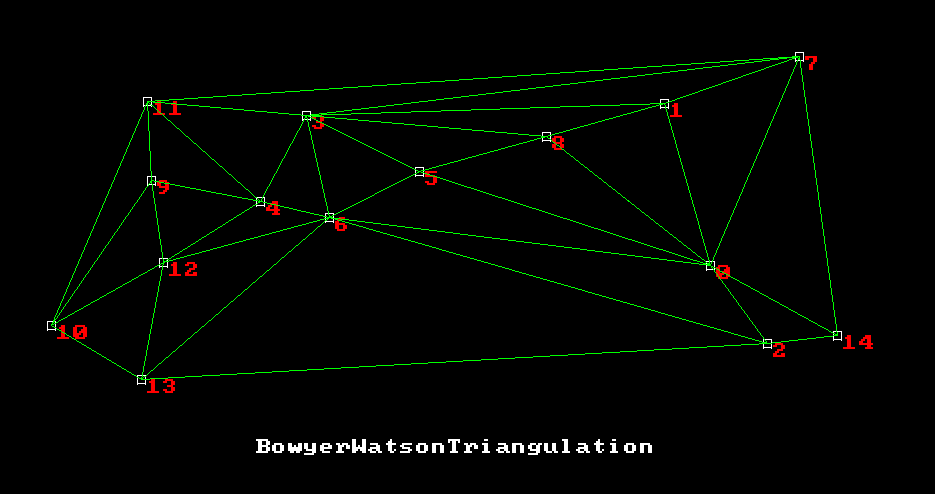
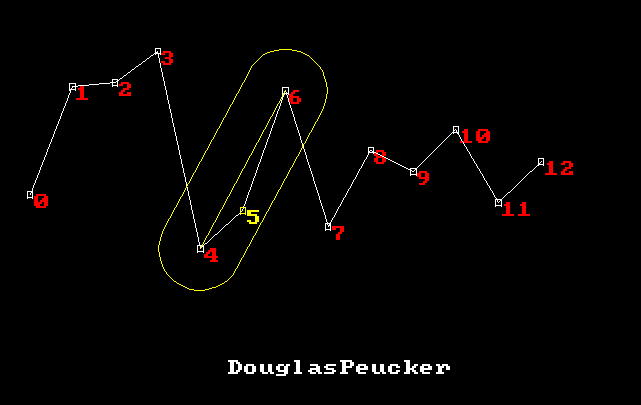
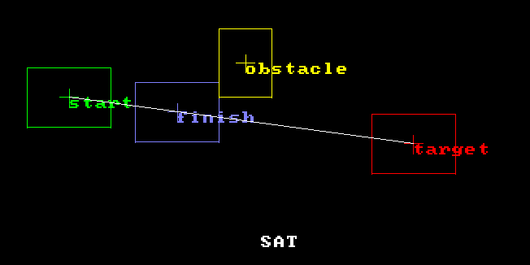

# GeomSandbox

Authors: Sebastien Alaiwan, Vivien Bonnet

Description
-----------

This is a sandbox for prototyping computational geometry algorithms.
It uses fibers to allow visual single-stepping through algorithms,
while keeping intrusivity minimal.

It uses SDL2.

<p align="center"></p>

<p align="center"></p>

<p align="center"></p>

Build
-----

Requirements:
```
* libsdl2-dev
```

It can be compiled to native code using your native compiler (gcc or clang):

```
$ make
```

The binaries will be generated to a 'bin' directory
(This can be overriden using the BIN makefile variable).

Run the sandbox
---------------

Just run the following command:

```
$ bin/GeomSandbox.exe <appName>
```

For example:

```
$ bin/GeomSandbox.exe Example
```

Keys:
* F2 : reset the algorithm with new input data.
* Space: single-step the current algorithm.
* Return: finish the current algorithm.
* Keypad +/- : zoom/dezoom
* Keypad arrows : scroll
