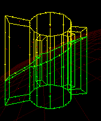
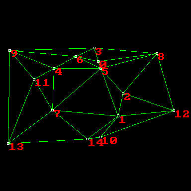
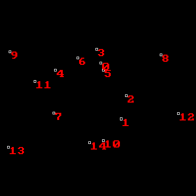
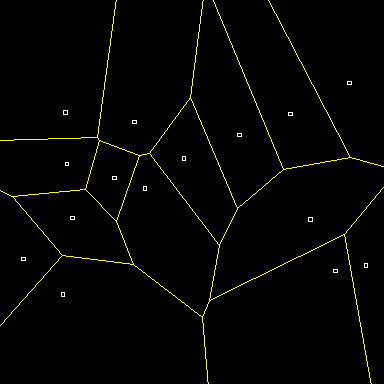
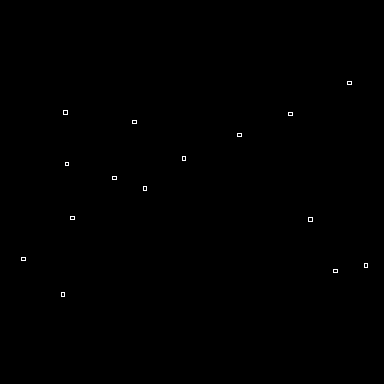
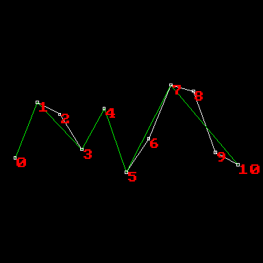
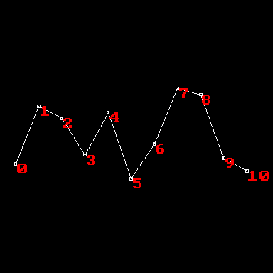
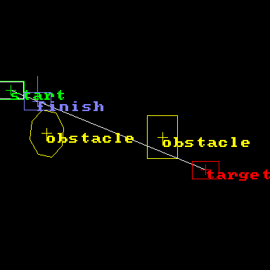
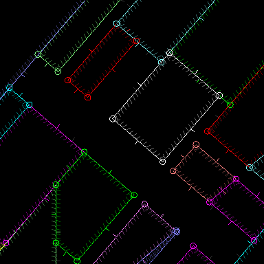
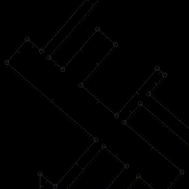

# GeomSandbox

Authors: Sebastien Alaiwan, Vivien Bonnet

Description
-----------

This is a sandbox for prototyping computational geometry algorithms.
It uses fibers to allow visual single-stepping through algorithms,
while keeping intrusivity minimal.

Design Guidelines
-----------------

The goal here is to be able to easily copy prototyped algorithm code
to other projects, where it won't be as easy to experiment with.

So we don't want the algorithm implementations to depend too much on this project.

This is why the core sandbox only provides the absolute minimum data structures:
Vec2, which is used for communication between the algorithm and the sandbox,
and span, whose implementation leaves not much room for choice anyway.

More advanced geometric data structures are expected to be provided by the
specific algorithm implementations.

Gallery
-------

Arbitrary polyhedron clipping:

<p align="center">
   
   
</p>

Triangulation using the Bowyer-Watson algorithm:

<p align="center">
   
   
</p>

Voronoi diagram using the Fortune algorithm:

<p align="center">
   
   
</p>

Polyline simplification using the Douglas-Peucker algorithm:

<p align="center">
   
   
</p>

Continuous collision detection using the separating-axis-theorem:

<p align="center">
   
   
</p>

Convex space partitionning using BSP:

<p align="center">
   
   
</p>

Build
-----

Requirements:
```
* libsdl2-dev
```

It can be compiled to native code using your native compiler (gcc or clang):

```
$ make
```

The binaries will be generated to a 'bin' directory
(This can be overriden using the BIN makefile variable).

Run the sandbox
---------------

Just run the following command:

```
$ bin/GeomSandbox.exe <appName>
```

For example:

```
$ bin/GeomSandbox.exe Example
```

Keys:
* F2 : reset the algorithm with new input data.
* Space: single-step the current algorithm.
* Return: finish the current algorithm.
* Keypad +/- : zoom/dezoom
* Keypad arrows : scroll
